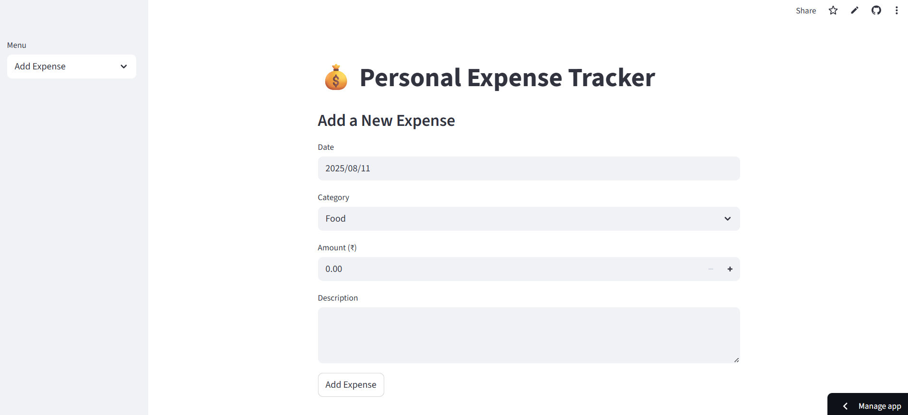

# 💰 Personal Expense Tracker

A simple and interactive **web application** to track, manage, and visualize your daily expenses.  
Built with **Python**, **Streamlit**, and **SQLite**, this project helps users add expenses, view summaries, and download reports.

---

## 🚀 Features
- **Add Expenses** with date, category, amount, and description
- **View All Expenses** in a clean, searchable table
- **Category-wise Expense Visualization** (bar chart)
- **Monthly Expense Trends** (line chart)
- **Download Reports** as CSV
- **Lightweight Database** with SQLite

---

## 🛠️ Tech Stack
- **Frontend:** [Streamlit](https://streamlit.io/)
- **Backend:** Python
- **Database:** SQLite
- **Libraries:** Pandas, Matplotlib/Streamlit Charts

---

## 📂 Project Structure
expense_tracker/
│── app.py # Main Streamlit application
│── db.py # Database functions (CRUD)
│── expenses.db # SQLite database file (auto-created)
│── requirements.txt # Required Python packages
│── README.md # Project documentation

---

## ⚡ Installation & Setup

1. **Clone the Repository**
   ```bash
   git clone https://github.com/Chirag-O2004/expense-tracker.git
   cd expense-tracker
2. **Install Dependencies**
    pip install -r requirements.txt
3. **Run the App**
    streamlit run app.py

## 📸 Screenshots
    ### 🏠 Home Page


### 📊 Expense Chart


## Live Demo
    https://expense-tracker-euujfqirurekvuczbstutq.streamlit.app/

## 📌 Future Enhancements
   - User Authentication
   - Multi-user support
   - Export to Excel
   - AI-based expense categorization

## 📜 License
    This project is licensed under the MIT License - feel free to use and modify.

## 👨‍💻 Developed by Chirag O
---

    Once you drop this into your folder and push to GitHub, your repo will look **professional** and recruiter-friendly.  
    After you deploy on **Streamlit Cloud**, just replace the `"your-deployment-link"` with your live app link.  

    Do you want me to also make **real screenshots** of your app right now so you can replace the placeholders?  
    That will make your GitHub page look way more legit.
